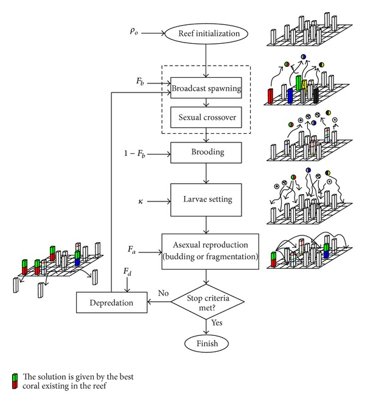
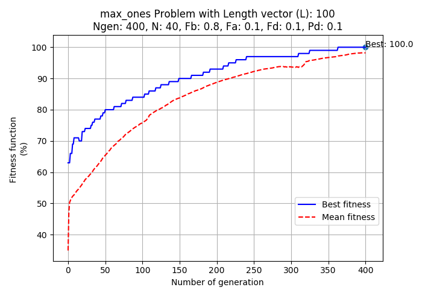

# coral-reef-optimization-algorithm
Coral Reefs Optimization (CRO) algorithm artificially simulates a coral reef, where different corals (which are the solutions for the considered optimization problem) grow and reproduce in a coral-reef, fighting with other corals for space

Flow diagram of the proposed CRO algorithm:



The main file is in main_cro.py. It proceeds to call to the rest of functions implemented.

### Results for max_ones problem
In this problem, [max_ones problem](https://github.com/Oddsor/EvolAlgo/wiki/Max-One-Problem), the health function is just the number of ones in the coral in percentage

The code is designed in this case to solve the max-ones problem (maximize the number of 1s in a bit string), so if you want to change to a different problem,
you'll have to modify some functions (coral initialization, fitness, etc.)
The function lavaecorrection() is void in this case, since it is not necessary in max-ones (there are not constraints to be fulfiled). However, it is called in mainCRO to check when it must be called. 

The following results can be reproduced with command:  
```
python python main_cro.py --Ngen=400 --N=40 --Fb=0.8 --problem=max_ones --opt_type=max
```

*Name* | *Epoch 400 Fb=0.8* |
:---: | :---: |
Max-One-Problem |  |

### Results for features selection problem
(to be added)

## Folder structure
The following shows basic folder structure.
```
├── main_cro.py # gateway
├── CRO.py #libs
├── assests
│   ├── data # dataset examples
│   |   ├── voice.csv
│   ├── max_ones_results

```

## Acknowledgements
This implementation has been based on Sancho Salcedo's idea and [this proyect](http://agamenon.tsc.uah.es/Personales/sancho/CRO.html) and tested with Python over ver3.0 on Windows 10
