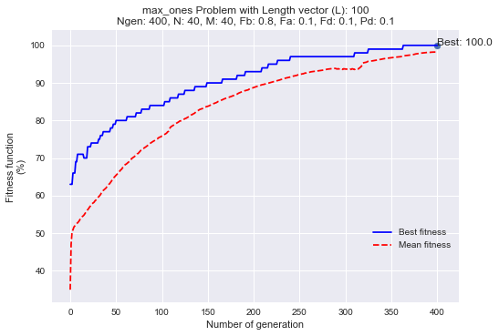

# coral-reef-optimization-algorithm
Coral Reefs Optimization (CRO) algorithm artificially simulates a coral reef, where different corals (which are the solutions for the considered optimization problem) grow and reproduce in a coral-reef, fighting with other corals for space and find depredation.

Flow diagram of the proposed CRO algorithm:


Te original idea was proposed by [Sancho Salcedo](http://agamenon.tsc.uah.es/Personales/sancho/CRO.html) 

Publication link: [The Coral Reefs Optimization Algorithm: A Novel Metaheuristic for Efficiently Solving Optimization Problems](https://www.researchgate.net/publication/264985908_The_Coral_Reefs_Optimization_Algorithm_A_Novel_Metaheuristic_for_Efficiently_Solving_Optimization_Problems)


Install
-------

To install the library use pip:

    pip install cro


or clone the repo and just type the following on your shell:

    python setup.py install

Usage examples
--------------
Example of usage for max_ones problem. In this problem, [max_ones problem](https://github.com/Oddsor/EvolAlgo/wiki/Max-One-Problem), the health function is just the number of ones in the coral in percentage

The following results can be reproduced with command:  

```python
import numpy as np
import seaborn as sns #not necessary, just better plots
from cro import *

## ------------------------------------------------------
## Parameters initialization

Ngen = 400                 # Number of generations
N  = 40                    # MxN: reef size
M  = 40                    # MxN: reef size
Fb = 0.8                   # Broadcast prob.
Fa = 0.1                   # Asexual reproduction prob.
Fd = 0.1                   # Fraction of the corals to be eliminated in the depredation operator.
r0 = 0.7                   # Free/total initial proportion
k  = 3                     # Number of opportunities for a new coral to settle in the reef
Pd = 0.1                   # Depredation prob.
opt= 'max'                 # flag: 'max' for maximizing and 'min' for minimizing
L = 100

problem ='max_ones'
## ------------------------------------------------------

cro = CRO(Ngen, N, M, Fb, Fa, Fd, r0, k, Pd, opt, L,  problem_name=problem)
(REEF, REEFpob, REEFfitness, ind_best, Bestfitness, Meanfitness) = cro.fit()
```

 

### Results for feature selection problem

This example uses a database which was created to identify a voice as male or female (binary target), based upon acoustic properties of the voice and speech. Originally, it contains 20 features and I added 10 noisy ones at the end

```python

import numpy as np
import seaborn as sns 
from cro import *
from sklearn.neighbors import KNeighborsClassifier

## ------------------------------------------------------
## Parameters initialization

Ngen = 80                  # Number of generations
N  = 10                    # MxN: reef size
M  = 10                    # MxN: reef size
Fb = 0.8                   # Broadcast prob.
Fa = 0.3                   # Asexual reproduction prob.
Fd = 0.1                   # Fraction of the corals to be eliminated in the depredation operator.
r0 = 0.6                   # Free/total initial proportion
k  = 3                     # Number of opportunities for a new coral to settle in the reef
Pd = 0.1                   # Depredation prob.
opt= 'max'                 # flag: 'max' for maximizing and 'min' for minimizing
problem ='feature_selection'
## ------------------------------------------------------

dataset = load_data('voice')
L = dataset.data.shape[1] # number of features
X = dataset.data
y = dataset.target

clf = KNeighborsClassifier(2)

cro = CRO(Ngen, N, M, Fb, Fa, Fd, r0, k, Pd, opt, L, seed=13, problem_name=problem, metric= 'auc', verbose=True)
%time (REEF, REEFpob, REEFfitness, ind_best, Bestfitness, Meanfitness) = cro.fit(X, y, clf)

names = np.array(dataset.feature_names)
print(names[REEFpob[:, ind_best]>0])
```

## Folder structure
The following shows basic folder structure.
```
├── cro #package name
│   ├── cro.py # libs
│   ├── utils.py
│   ├── test.ipynb
├── assests
│   ├── data
│   |   ├── voice.csv

```

## Acknowledgements
This implementation has been based on Sancho Salcedo's idea and [this proyect](http://agamenon.tsc.uah.es/Personales/sancho/CRO.html) and tested with Python over version 3.0
