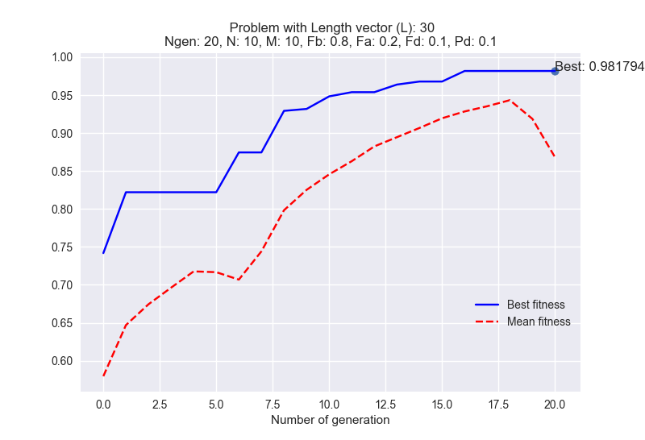

[](https://pypi.python.org/pypi/cro)
[](http://travis-ci.org/VictorPelaez/coral-reef-optimization-algorithm)

# coral-reef-optimization-algorithm
Coral Reefs Optimization (CRO) algorithm artificially simulates a coral reef, where different corals (which are the solutions for the considered optimization problem) grow and reproduce in a coral-reef, fighting with other corals for space and find depredation.

Flow diagram of the proposed CRO algorithm:


Publication link: [The Coral Reefs Optimization Algorithm: A Novel Metaheuristic for Efficiently Solving Optimization Problems](https://www.researchgate.net/publication/264985908_The_Coral_Reefs_Optimization_Algorithm_A_Novel_Metaheuristic_for_Efficiently_Solving_Optimization_Problems)


Install
-------

To install the library use pip:

    pip install cro


or clone the repo and just type the following on your shell:

    python setup.py install

Usage examples
--------------
Example of usage for max_ones problem. In this problem, [max_ones problem](https://github.com/Oddsor/EvolAlgo/wiki/Max-One-Problem), the health function is just the number of ones in the coral in percentage

The following results can be reproduced with command:  

```python
import numpy as np
import seaborn as sns 
from cro import *
from cro.fitness import max_ones

## ------------------------------------------------------
## Parameters initialization
## ------------------------------------------------------
Ngen = 30                  # Number of generations
N  = 20                    # MxN: reef size
M  = 20                    # MxN: reef size
Fb = 0.7                   # Broadcast prob.
Fa = 0.1                   # Asexual reproduction prob.
Fd = 0.1                   # Fraction of the corals to be eliminated in the depredation operator.
r0 = 0.6                   # Free/total initial proportion
k  = 3                     # Number of opportunities for a new coral to settle in the reef
Pd = 0.1                   # Depredation prob.
opt= 'max'                 # flag: 'max' for maximizing and 'min' for minimizing
L = 100
ke = 0.2
## ------------------------------------------------------

cro = CRO(Ngen, N, M, Fb, Fa, Fd, r0, k, Pd, max_ones, opt, L, verbose=False, ke=ke)
%time (REEF, REEFpob, REEFfitness, ind_best, Bestfitness, Meanfitness) = cro.fit()
```
Output:

 

```
Best coral:  [1 1 1 1 1 1 1 1 1 1 1 1 1 1 1 1 1 1 1 1 1 1 1 1 1 1 1 1 1 1 1 1 1 1 1 1 1
 1 1 1 1 1 1 1 1 1 1 1 1 1 1 1 1 1 1 1 1 1 1 1 1 1 1 1 1 1 1 1 1 1 1 1 1 1
 1 1 1 1 1 1 1 1 1 1 1 1 1 1 1 1 1 1 1 1 1 1 1 1 1 1]
Best solution: 100.0
Wall time: 1.06 s
```


### Results for feature selection problem

This example uses a database which was created to identify a voice as male or female (binary target), based upon acoustic properties of the voice and speech. Originally, it contains 20 features and I added 10 noisy ones at the end.
More examples in this [notebook](cro/test.ipynb)

```python
from functools import partial
import numpy as np
import seaborn as sns 
from sklearn.neighbors import KNeighborsClassifier
from sklearn.metrics import roc_auc_score

from cro import *
from cro.utils import load_data
from cro.fitness import feature_selection


## ------------------------------------------------------
## Parameters initialization
## ------------------------------------------------------
Ngen = 20                  # Number of generations
N  = 10                    # MxN: reef size
M  = 10                    # MxN: reef size
Fb = 0.8                   # Broadcast prob.
Fa = 0.2                   # Asexual reproduction prob.
Fd = 0.1                   # Fraction of the corals to be eliminated in the depredation operator.
r0 = 0.6                   # Free/total initial proportion
k  = 3                     # Number of opportunities for a new coral to settle in the reef
Pd = 0.1                   # Depredation prob.
opt= 'max'                 # flag: 'max' for maximizing and 'min' for minimizing
## ------------------------------------------------------

dataset = load_data('voice')
L = dataset.data.shape[1] # number of features
X = dataset.data
y = dataset.target

clf = KNeighborsClassifier(2)

fitness_coral = partial(feature_selection, X=X, y=y, model=clf,
                        get_prediction = lambda clf, X: clf.predict_proba(X)[:, 1], 
                        metric=roc_auc_score)

cro = CRO(Ngen, N, M, Fb, Fa, Fd, r0, k, Pd, fitness_coral, opt, L, seed=13, verbose=True)
%time (REEF, REEFpob, REEFfitness, ind_best, Bestfitness, Meanfitness) = cro.fit(X, y, clf)

names = np.array(dataset.feature_names)
print(names[REEFpob[ind_best, :]>0])
```

Output:
 

```
Best coral:  [0 0 0 1 0 1 1 0 0 0 0 1 1 0 1 0 1 0 0 0 0 0 0 0 0 0 0 0 0 0]
Best solution: 0.98179427934
Wall time: 35.9 s
['Q25' 'IQR' 'skew' 'centroid' 'meanfun' 'maxfun' 'mindom']
```

## Folder structure
The following shows basic folder structure.

```
├── cro 
│   ├── __init__.py
│   ├── cro.py 
│   ├── fitness.py
│   ├── larvaemutation.py
│   ├── utils.py
│   ├── tests.py
│   ├── assests 
│   |   ├── data
│   |   |	├── voice.csv
├── examples 
│   ├── __init__.py
│   ├── context.py
│   ├── example_basic.py
│   ├── example_advanced.py
├── tests

```

## Acknowledgements
This implementation has been based on Sancho Salcedo's idea and [this proyect](http://agamenon.tsc.uah.es/Personales/sancho/CRO.html) 
